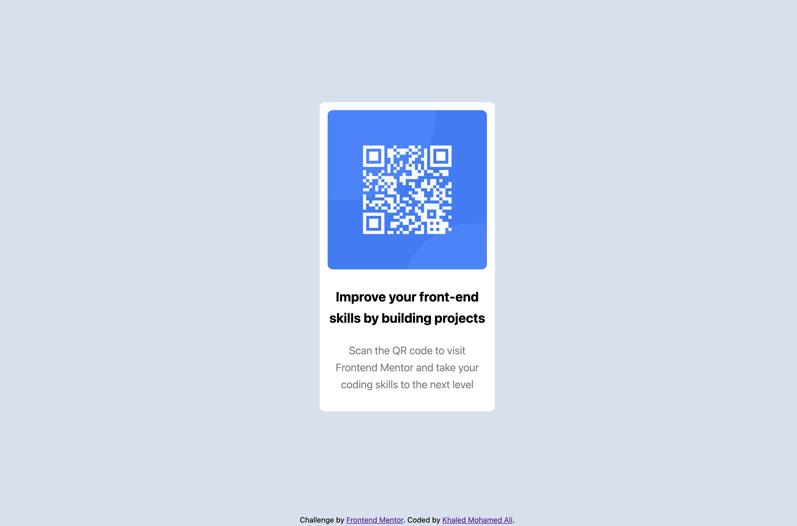

# Frontend Mentor - QR code component solution

This is a solution to the [QR code component challenge on Frontend Mentor](https://www.frontendmentor.io/challenges/qr-code-component-iux_sIO_H)
## Table of contents

- [Frontend Mentor - QR code component solution](#frontend-mentor---qr-code-component-solution)
  - [Table of contents](#table-of-contents)
  - [Overview](#overview)
    - [Screenshot](#screenshot)
    - [Links](#links)
  - [My process](#my-process)
    - [Built with](#built-with)
    - [What I learned](#what-i-learned)
  - [Author](#author)
  - [Acknowledgments](#acknowledgments)


## Overview
In this Challenge I build a simple Qr code Card

### Screenshot



### Links

- Solution URL: [Add solution URL here](https://github.com/khaled-mohamedali/FrontEndDesign/tree/main/qr-code-component-main)

## My process

### Built with

- Semantic HTML5 markup
- CSS custom properties
- Flexbox

### What I learned
While working on this project, I reinforced my understanding of:

1. Centering elements both horizontally and vertically using Flexbox:
```css
body {
  display: flex;
  justify-content: center;
  align-items: center;
  min-height: 100vh;
}


## Author

- Website - [Khaled Mohamed Ali](https://www.devcircuit.net)
- Frontend Mentor - [@khaled-mohamedali](https://www.frontendmentor.io/profile/khaled-mohamedali)


## Acknowledgments

[Mosh Hamadani](https://codewithmosh.com/p/the-ultimate-html-css)